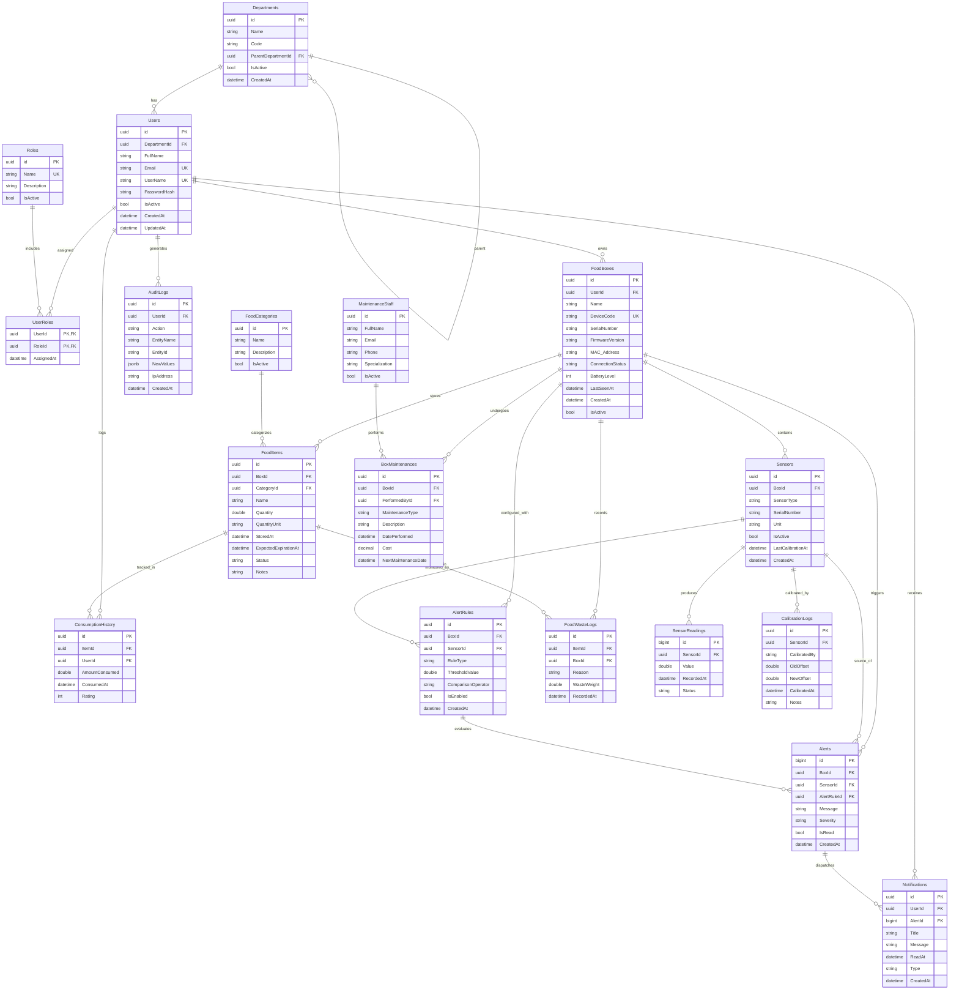

## 1. Entity-Relationship (ER) Diagram

```mermaid
erDiagram
    Departments ||--o{ Departments : "parent"
    Departments ||--o{ Users : "has"
    Users ||--o{ UserRoles : "assigned"
    Roles ||--o{ UserRoles : "includes"
    Users ||--o{ FoodBoxes : "owns"
    Users ||--o{ ConsumptionHistory : "logs"
    Users ||--o{ Notifications : "receives"
    Users ||--o{ AuditLogs : "generates"

    FoodBoxes ||--o{ Sensors : "contains"
    FoodBoxes ||--o{ FoodItems : "stores"
    FoodBoxes ||--o{ AlertRules : "configured_with"
    FoodBoxes ||--o{ Alerts : "triggers"
    FoodBoxes ||--o{ BoxMaintenances : "undergoes"
    FoodBoxes ||--o{ FoodWasteLogs : "records"

    MaintenanceStaff ||--o{ BoxMaintenances : "performs"

    FoodCategories ||--o{ FoodItems : "categorizes"
    FoodItems ||--o{ ConsumptionHistory : "tracked_in"
    FoodItems ||--o{ FoodWasteLogs : "logged_in"

    Sensors ||--o{ SensorReadings : "produces"
    Sensors ||--o{ CalibrationLogs : "calibrated_by"
    Sensors ||--o{ AlertRules : "monitored_by"
    Sensors ||--o{ Alerts : "source_of"

    AlertRules ||--o{ Alerts : "evaluates"
    Alerts ||--o{ Notifications : "dispatches"

    Departments {
        uuid id PK
        string Name
        string Code
        uuid ParentDepartmentId FK
        bool IsActive
        datetime CreatedAt
    }

    Users {
        uuid id PK
        uuid DepartmentId FK
        string FullName
        string Email UK
        string UserName UK
        string PasswordHash
        bool IsActive
        datetime CreatedAt
        datetime UpdatedAt
    }

    Roles {
        uuid id PK
        string Name UK
        string Description
        bool IsActive
    }

    UserRoles {
        uuid UserId PK,FK
        uuid RoleId PK,FK
        datetime AssignedAt
    }

    FoodBoxes {
        uuid id PK
        uuid UserId FK
        string Name
        string DeviceCode UK
        string SerialNumber
        string FirmwareVersion
        string MAC_Address
        string ConnectionStatus
        int BatteryLevel
        datetime LastSeenAt
        datetime CreatedAt
        bool IsActive
    }

    Sensors {
        uuid id PK
        uuid BoxId FK
        string SensorType
        string SerialNumber
        string Unit
        bool IsActive
        datetime LastCalibrationAt
        datetime CreatedAt
    }

    SensorReadings {
        bigint id PK
        uuid SensorId FK
        double Value
        datetime RecordedAt
        string Status
    }

    CalibrationLogs {
        uuid id PK
        uuid SensorId FK
        string CalibratedBy
        double OldOffset
        double NewOffset
        datetime CalibratedAt
        string Notes
    }

    FoodCategories {
        uuid id PK
        string Name
        string Description
        bool IsActive
    }

    FoodItems {
        uuid id PK
        uuid BoxId FK
        uuid CategoryId FK
        string Name
        double Quantity
        string QuantityUnit
        datetime StoredAt
        datetime ExpectedExpirationAt
        string Status
        string Notes
    }

    ConsumptionHistory {
        uuid id PK
        uuid ItemId FK
        uuid UserId FK
        double AmountConsumed
        datetime ConsumedAt
        int Rating
    }

    FoodWasteLogs {
        uuid id PK
        uuid ItemId FK
        uuid BoxId FK
        string Reason
        double WasteWeight
        datetime RecordedAt
    }

    AlertRules {
        uuid id PK
        uuid BoxId FK
        uuid SensorId FK
        string RuleType
        double ThresholdValue
        string ComparisonOperator
        bool IsEnabled
        datetime CreatedAt
    }

    Alerts {
        bigint id PK
        uuid BoxId FK
        uuid SensorId FK
        uuid AlertRuleId FK
        string Message
        string Severity
        bool IsRead
        datetime CreatedAt
    }

    Notifications {
        uuid id PK
        uuid UserId FK
        bigint AlertId FK
        string Title
        string Message
        datetime ReadAt
        string Type
        datetime CreatedAt
    }

    MaintenanceStaff {
        uuid id PK
        string FullName
        string Email
        string Phone
        string Specialization
        bool IsActive
    }

    BoxMaintenances {
        uuid id PK
        uuid BoxId FK
        uuid PerformedById FK
        string MaintenanceType
        string Description
        datetime DatePerformed
        decimal Cost
        datetime NextMaintenanceDate
    }

    AuditLogs {
        uuid id PK
        uuid UserId FK
        string Action
        string EntityName
        string EntityId
        jsonb NewValues
        string IpAddress
        datetime CreatedAt
    }
```
